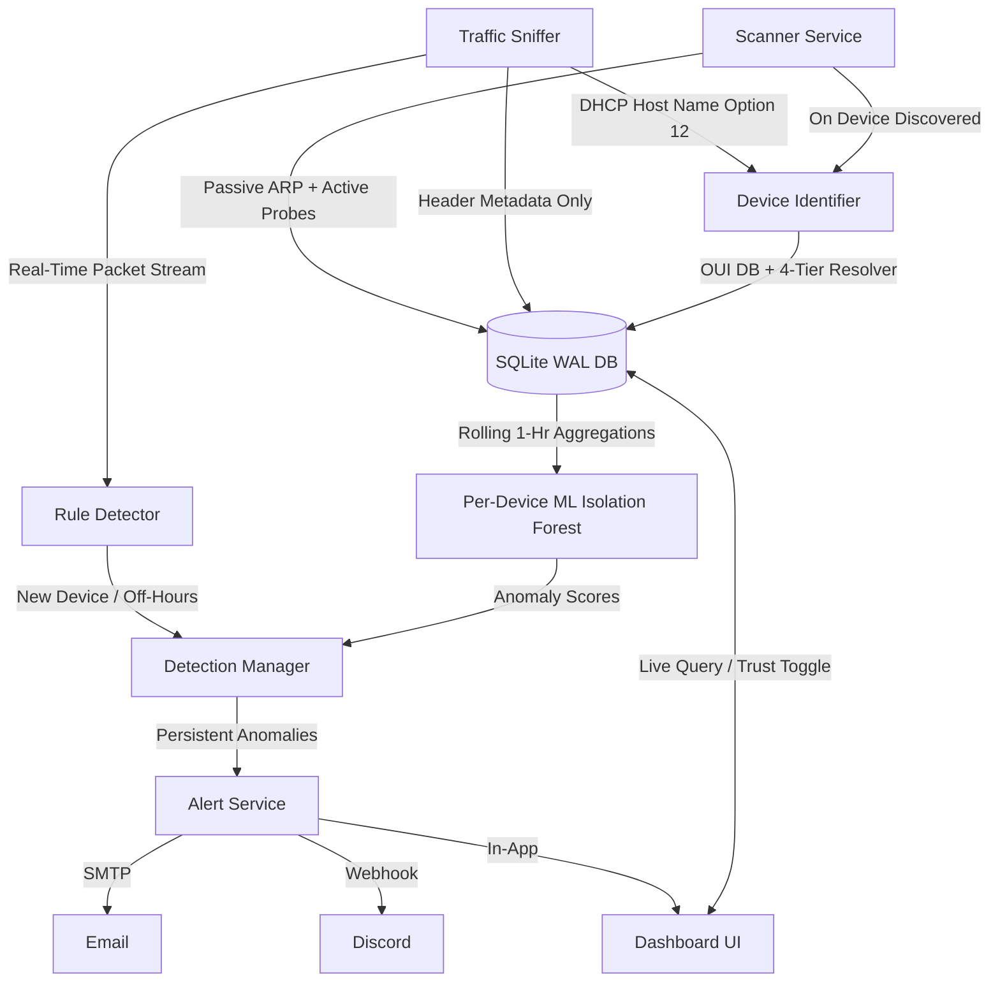

# 📘 NetGuardian Implementation Guide & Technical Specification

> **College Minor Project Documentation & Implementation Details**  
> *NetGuardian: Lightweight, Autonomous Network Monitoring & Anomaly Sentinel*

---

## 1. Architectural Blueprint

NetGuardian is structured into decoupled, single-responsibility modules operating over a shared SQLite database with Write-Ahead Logging (WAL) enabled:



---

## 2. Phase-by-Phase Technical Implementation

### Phase 1: Database Schema & Access Layer
* **File:** [`database/schema.sql`](file:///c:/Users/AdarshSingh/OneDrive/Desktop/Net_Guardians/database/schema.sql), [`database/db.py`](file:///c:/Users/AdarshSingh/OneDrive/Desktop/Net_Guardians/database/db.py)
* **Design Considerations:**
  * SQLite was chosen to satisfy the **zero-cost, zero-configuration** requirement.
  * Configured with `PRAGMA journal_mode=WAL;` and `PRAGMA synchronous=NORMAL;` to allow the background packet sniffer and ARP scanner to execute write operations simultaneously while the Flask dashboard queries device summaries without encountering database lock errors.
  * Provides `upsert_device()` which returns `(is_new, record)` so the rule detector can flag first-time device arrivals without redundant queries.
  * Provides `batch_log_traffic()` to write packet logs in bulk buffers, achieving high throughput without disk thrashing.

### Phase 2: Scanner Module (Active & Passive ARP)
* **Files:** [`scanner/network_utils.py`](file:///c:/Users/AdarshSingh/OneDrive/Desktop/Net_Guardians/scanner/network_utils.py), [`scanner/passive_scanner.py`](file:///c:/Users/AdarshSingh/OneDrive/Desktop/Net_Guardians/scanner/passive_scanner.py), [`scanner/active_scanner.py`](file:///c:/Users/AdarshSingh/OneDrive/Desktop/Net_Guardians/scanner/active_scanner.py), [`scanner/scanner_service.py`](file:///c:/Users/AdarshSingh/OneDrive/Desktop/Net_Guardians/scanner/scanner_service.py)
* **Mechanics:**
  * **Passive Scanning:** Reads the operating system ARP cache using `arp -a` (or `/proc/net/arp` on Linux). This is silent, non-intrusive, and consumes virtually 0% CPU.
  * **Active Subnet Probing:** Automatically calculates the local subnet CIDR (e.g. `192.168.1.0/24`) and sends Layer 2 Ethernet broadcast frames (`Ether(dst="ff:ff:ff:ff:ff:ff")/ARP(pdst=subnet)`) using Scapy's `srp`. This forces silent and sleeping hosts to respond with their MAC and IP.
  * Filters out IPv4/IPv6 multicast addresses (`01:00:5e:*`, `33:33:*`, `224.0.0.0/4`), broadcast (`ff:ff:ff:ff:ff:ff`), and loopback addresses.

### Phase 3: Identification Module
* **Files:** [`identification/vendor_lookup.py`](file:///c:/Users/AdarshSingh/OneDrive/Desktop/Net_Guardians/identification/vendor_lookup.py), [`identification/hostname_resolver.py`](file:///c:/Users/AdarshSingh/OneDrive/Desktop/Net_Guardians/identification/hostname_resolver.py), [`identification/device_identifier.py`](file:///c:/Users/AdarshSingh/OneDrive/Desktop/Net_Guardians/identification/device_identifier.py)
* **Vendor Lookup:**
  1. **Tier 1 (Offline OUI DB):** Loaded from [`data/oui_cache.json`](file:///c:/Users/AdarshSingh/OneDrive/Desktop/Net_Guardians/data/oui_cache.json), containing IEEE mappings for Apple, Samsung, Intel, TP-Link, Dell, HP, Espressif, Raspberry Pi, Cisco, etc. Provides instant $O(1)$ in-memory lookups.
  2. **Tier 2 (Free Online Fallback):** If an OUI is missing locally, queries `https://api.macvendors.com/` (free tier) with rate-limiting (max 1 request/sec) and automatically writes newly discovered vendors back into the local JSON cache.
* **4-Tier Hostname Fallback Chain:**
  1. **DHCP Option 12 (Host Name):** Sniffed passively during DHCP lease acquisition. Most authoritative machine name directly self-reported by the device OS.
  2. **mDNS / Zeroconf:** Queries multicast DNS (port 5353) for `_workstation._tcp.local.` and reverse `.local.` PTR records.
  3. **Reverse DNS:** Standard socket `gethostbyaddr(ip)` query against the local gateway / DNS forwarder.
  4. **NetBIOS Node Status:** Queries NetBIOS over TCP/IP (RFC 1002 port 137) or native `nbtstat` on Windows, resolving legacy Windows and Samba shares.
  * *First protocol that returns a valid name wins and is stored in the database.*

### Phase 4: Traffic Capture Module (Header-Only)
* **Files:** [`traffic/packet_parser.py`](file:///c:/Users/AdarshSingh/OneDrive/Desktop/Net_Guardians/traffic/packet_parser.py), [`traffic/sniffer.py`](file:///c:/Users/AdarshSingh/OneDrive/Desktop/Net_Guardians/traffic/sniffer.py)
* **Zero Payload Guarantee:**
  * Extracts only Layer 2 (source/destination MAC), Layer 3 (source/destination IPv4), and Layer 4 (TCP/UDP ports, protocol identification, packet wire length).
  * Classifies protocols by header ports: TCP, UDP, DNS (53), mDNS (5353), HTTP (80, 8080), HTTPS (443, 8443), DHCP (67, 68), NTP (123), SSH (22), ARP, ICMP.
  * Packets are pushed to an asynchronous in-memory queue. A dedicated writer thread flushes batches to SQLite every 1.0 second or 50 packets to ensure packet capture is never blocked by I/O.

### Phase 5: Rule-Based Detection
* **File:** [`detection/rule_detector.py`](file:///c:/Users/AdarshSingh/OneDrive/Desktop/Net_Guardians/detection/rule_detector.py)
* **Rules Implemented:**
  * **Rule A (New Device):** Flags any device appearing on the local network for the first time if not explicitly marked trusted.
  * **Rule B (Off-Hours Activity):** Each device has an active schedule (e.g., `09:00 - 18:00` for office desktops or smart cameras). Any traffic detected outside this active window flags a `HIGH` severity anomaly.
  * Rate-limiting prevents alert floods when a device is streaming packets off-hours.

### Phase 6: Machine Learning Anomaly Detection (Isolation Forest)
* **File:** [`detection/ml_engine.py`](file:///c:/Users/AdarshSingh/OneDrive/Desktop/Net_Guardians/detection/ml_engine.py)
* **Model Mechanics:**
  * Features extracted per hourly window:
    $$\mathbf{x} = [\text{packet\_count}, \text{byte\_volume}, \text{hour\_of\_day}, \text{protocol\_variety}]$$
  * An unsupervised `IsolationForest(contamination=0.05, n_estimators=100)` is trained per device once baseline traffic is accumulated.
  * Scored using `decision_function`: values below the threshold (default $\le -0.15$) represent statistically anomalous volume or schedule patterns.

### Phase 7: False-Positive Handling
* **File:** [`detection/detection_manager.py`](file:///c:/Users/AdarshSingh/OneDrive/Desktop/Net_Guardians/detection/detection_manager.py)
* **Controls:**
  1. **Trust-Marking:** Users can mark a known device as "trusted". Trusted devices do not generate new-device alerts, and their observed metrics form the accepted baseline.
  2. **Consecutive Window Confirmation:** Single-window traffic spikes (e.g. streaming a video or running a software update) often appear anomalous in a single window. NetGuardian **only alerts if the anomaly persists across $\ge 2$ consecutive observation windows**. If the device returns to normal behavior, the anomaly streak is reset to 0.

### Phase 8: Flask Dashboard
* **Files:** [`dashboard/app.py`](file:///c:/Users/AdarshSingh/OneDrive/Desktop/Net_Guardians/dashboard/app.py), [`dashboard/templates/index.html`](file:///c:/Users/AdarshSingh/OneDrive/Desktop/Net_Guardians/dashboard/templates/index.html), [`dashboard/static/style.css`](file:///c:/Users/AdarshSingh/OneDrive/Desktop/Net_Guardians/dashboard/static/style.css), [`dashboard/static/dashboard.js`](file:///c:/Users/AdarshSingh/OneDrive/Desktop/Net_Guardians/dashboard/static/dashboard.js)
* **Features:**
  * High-tech cybersecurity dark mode interface with Inter & JetBrains Mono typography.
  * Real-time metrics counters: Total Devices, Active Devices (seen in last 10m), Total Packets, Unresolved Anomalies.
  * Live device list with vendor badge, resolved hostname, ML anomaly score indicator, and one-click trust toggle.
  * Anomalies & alerts history view with one-click resolution.
  * Live traffic stream table showing header metadata.
  * On-demand "Scan Subnet Now" button.
  * Background polling auto-refreshes counters every 10 seconds.

### Phase 9: Alerting (Email & Discord)
* **Files:** [`alerts/email_notifier.py`](file:///c:/Users/AdarshSingh/OneDrive/Desktop/Net_Guardians/alerts/email_notifier.py), [`alerts/discord_notifier.py`](file:///c:/Users/AdarshSingh/OneDrive/Desktop/Net_Guardians/alerts/discord_notifier.py), [`alerts/alert_service.py`](file:///c:/Users/AdarshSingh/OneDrive/Desktop/Net_Guardians/alerts/alert_service.py)
* **Features:**
  * **Email (SMTP):** Generates styled HTML emails with anomaly details and severity badges via free Gmail/Outlook/standard SMTP.
  * **Discord Webhook:** Formats rich Discord Embeds color-coded by severity (Red for High, Orange for Medium, Blue for Low).
  * **Audit Trail:** Every alert attempt (Email, Discord, Dashboard) is permanently logged in the SQLite `alerts` table with timestamp and status (`SENT` or `FAILED`).

---

## 3. Quickstart Guide

### Start the Complete System
```powershell
# In PowerShell (Run as Administrator for packet sniffing)
.\.venv\Scripts\python main.py
```
Open your browser at: **`http://127.0.0.1:5000`**

### Test Single Modules
```powershell
# Run only the Flask dashboard
.\.venv\Scripts\python main.py --dashboard-only

# Perform a single ARP discovery scan
.\.venv\Scripts\python main.py --scan-once

# Run the unit tests
.\.venv\Scripts\pytest tests/test_database.py -v
```
